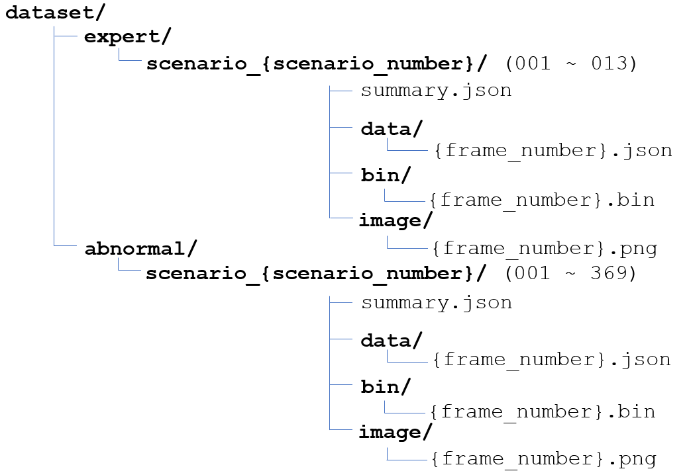

# R3-Driving-Dataset

R3 Driving Dataset is the dataset of the following paper:

*Jeongwoo Oh*1\*, *Gunmin Lee*1\*, *Jeongeun Park2, Wooseok Oh1, Jaeseok Heo1, Hojun Chung3, Do Hyung Kim4, Byungkyu Park4, Chang-Gun Lee4, Sungjoon Choi2, Songhwai Oh1*

RLLAB, Seoul National Univ.1, RiLAB, Korea Univ. 2, Department of Mechnical Engineering, Seoul National Univ. 3, RUBIS, Seoul National Univ. 4

<figure class="video_container">
  <iframe width="1080" height="720" src="https://www.youtube.com/embed/_YCVphKWeYM" frameborder="0" allowfullscreen="true"> </iframe>
</figure>

# Overview
Designing or learning an autonomous driving policy is undoubtedly a challenging task as the policy has to maintain its safety in all corner cases. In order to secure safety in autonomous driving, the ability to detect hazardous situations, which can be seen as an out-of-distribution (OOD) detection problem, becomes crucial. However, most conventional datasets only provide expert driving demonstrations, although some non-expert or uncommon driving behavior data are needed to implement a safety guaranteed autonomous driving platform. To this end, we present a novel dataset called the *R3 Driving Dataset*, composed of driving data with different qualities. The dataset categorizes abnormal driving behaviors into eight categories and 369 different detailed situations. The situations include dangerous lane changes and near-collision situations. To further enlighten how these abnormal driving behaviors can be detected, we utilize different uncertainty estimation and anomaly detection methods to the proposed dataset. From the results of the proposed experiment, it can be inferred that by using both uncertainty estimation and anomaly detection, most of the abnormal cases in the proposed dataset can be discriminated. The dataset of this paper can be downloaded from https://rllab-snu.github.io/projects/R3-Driving-Dataset/doc.html.

## Download

you can only download data files of R3 Driving Dataset from this repository. 
If you want to download full version of the dataset, please contact to the following e-mail address with some information.
The information must be contained *name, organization, purpose of use*.
e-mail: *jeongwoo.oh@rllab.snu.ac.kr*

## Data Structure

The following image denotes the data structure of R3 Driving Dataset.

